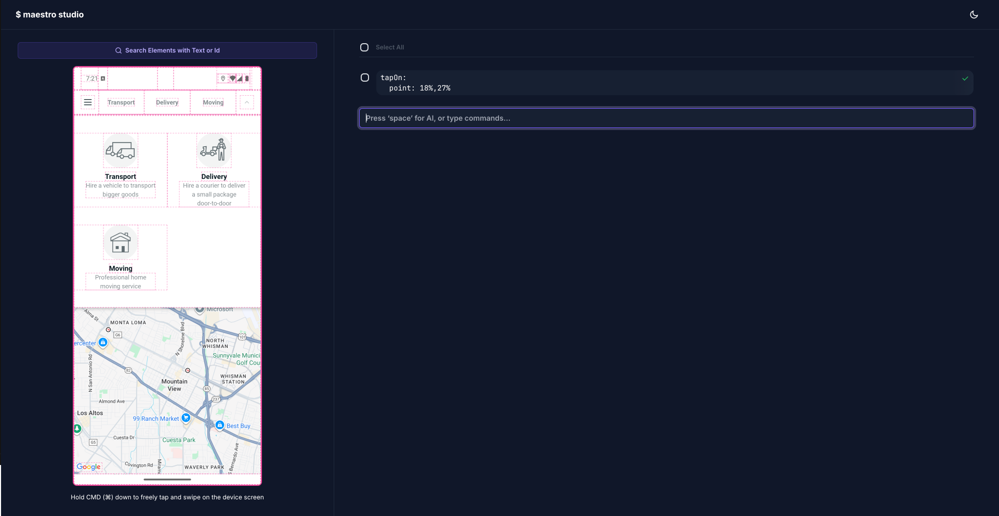

# GoGoX App E2E Automation with Maestro

This project contains End-to-End (E2E) automation tests for the GoGoX mobile application using [Maestro](https://maestro.dev/), a powerful mobile UI testing framework. The tests are designed to run on both Android and iOS platforms.

## 📱 About GoGoX App

GoGoX is a leading on-demand logistics platform that connects users with delivery services. This test suite ensures the quality and reliability of the mobile application across different devices and platforms.

## 🚀 Features

- **Cross-platform Testing**: Supports both Android and iOS platforms
- **Cloud-based Execution**: Runs on BrowserStack for scalable testing
- **Simple YAML Configuration**: Easy-to-read and maintain test flows
- **Visual Testing with Maestro Studio**: Interactive UI inspection and flow creation
- **Local & Device Testing**: Run tests on local devices or emulators
- **Comprehensive Coverage**: Tests critical user journeys and app functionality

## 🛠️ Prerequisites

Before running the tests, ensure you have the following installed:

- [Maestro CLI](https://docs.maestro.dev/getting-started/installing-maestro)
- Access to GoGoX app builds (Android APK/iOS IPA) or physical device with the app installed

### Installing Maestro

Run the following command to install Maestro on macOS, Linux or Windows (WSL):

```bash
curl -fsSL "https://get.maestro.mobile.dev" | bash
```

If you're on macOS, you can use Homebrew instead of the install script above:

```bash
brew tap mobile-dev-inc/tap
brew install maestro
```

💡 **Using Windows?** Follow this guide to get set up on a Windows machine: [Installing Maestro on Windows](https://docs.maestro.dev/getting-started/installing-maestro)

## 🔧 Configuration

### App Configuration

The main configuration is defined in `maestro/launch.yaml`:

```yaml
appId: hk.gogovan.GoGoVanClient2
---
- launchApp
```

This configuration:
- Specifies the GoGoX app bundle identifier
- Defines a basic launch test flow

## 🏃‍♂️ Running Tests

### Local Testing

For local development and testing:

```bash
# Run a specific flow
maestro test maestro/launch.yaml

# Run all flows in the maestro directory
maestro test maestro/

# Run with verbose output for debugging
maestro test --verbose maestro/launch.yaml
```

## 🔍 Available Maestro Commands

This project leverages Maestro's comprehensive command set. Here are some key commands you can use:

### Navigation & Interaction
- `launchApp` - Launch the application
- `tapOn` - Tap on UI elements
- `doubleTapOn` - Double tap on elements
- `longPressOn` - Long press on elements
- `swipe` - Swipe gestures
- `scroll` - Scroll actions
- `back` - Navigate back

### Input & Text
- `inputText` - Enter text into fields
- `eraseText` - Clear text from fields
- `pasteText` - Paste clipboard content
- `copyTextFrom` - Copy text from elements

### Assertions
- `assertVisible` - Verify element visibility
- `assertNotVisible` - Verify element is not visible
- `assertTrue` - Assert conditions
- `assertWithAI` - AI-powered assertions

### Advanced Features
- `waitForAnimationToEnd` - Wait for animations
- `takeScreenshot` - Capture screenshots
- `runScript` - Execute JavaScript
- `setLocation` - Mock GPS location
- `setOrientation` - Change device orientation

For a complete list of commands, refer to the [Maestro API Reference](https://docs.maestro.dev/api-reference/commands).

## 🎯 Maestro Studio

Maestro Studio is a powerful interactive tool that helps you create and debug test flows visually. It provides a real-time view of your app's UI hierarchy and allows you to interact with elements directly.



### Starting Maestro Studio

```bash
# Launch Maestro Studio
maestro studio
```

This will open a web interface in your browser where you can:

### Key Features

1. **Visual Element Inspection**
   - View the complete UI hierarchy of your app
   - Inspect element properties (id, text, accessibility labels)
   - See element bounds and positioning

2. **Interactive Testing**
   - Click on elements directly in the browser
   - Test interactions without writing YAML first
   - Generate test steps automatically

3. **Real-time Flow Creation**
   - Record your interactions as you perform them
   - Export recorded flows to YAML format
   - Edit and refine flows in real-time

4. **Debugging Support**
   - Step through existing flows
   - Identify why elements aren't being found
   - Validate selectors and assertions

### Using Maestro Studio Workflow

1. **Connect your device** and launch the app
2. **Start Maestro Studio**: `maestro studio`
3. **Inspect elements** by hovering over them in the browser
4. **Record interactions** by clicking the record button
5. **Export your flow** to a YAML file
6. **Refine and test** your generated flow

### Example Studio Workflow

```bash
# 1. Start studio
maestro studio

# 2. In the browser interface:
#    - Navigate through your app
#    - Click on elements to inspect them
#    - Record your test scenario
#    - Export as YAML

# 3. Save the generated flow
# 4. Test the flow
maestro test your-generated-flow.yaml
```

### Pro Tips for Studio Usage

- **Use Studio for element discovery**: When elements are hard to find, Studio shows all available selectors
- **Record complex gestures**: Studio can capture swipes, scrolls, and multi-touch interactions
- **Validate flows**: Use Studio to step through existing flows and debug issues
- **Generate base flows**: Create initial flows quickly, then refine them manually

## 📝 Writing Test Flows

### Basic Flow Structure

```yaml
appId: hk.gogovan.GoGoVanClient2
---
- launchApp
- tapOn: "Login"
- inputText: "user@example.com"
- tapOn: "Password"
- inputText: "password123"
- tapOn: "Sign In"
- assertVisible: "Welcome"
```


## 🐛 Troubleshooting

### Common Issues

1. **App not launching**: Verify the `appId` matches your app's bundle identifier
2. **Elements not found**: Use Maestro Studio to inspect UI elements and find correct selectors
3. **Timeouts**: Increase wait times for slow-loading screens
4. **Device connection**: Ensure your device is properly connected and recognized
5. **Flow execution fails**: Use Maestro Studio to step through flows and identify issues

### Debugging Commands

```bash
# View device hierarchy
maestro hierarchy

# Launch Maestro Studio for visual debugging
maestro studio

# Record a flow interactively
maestro record

# Run with detailed output
maestro test --verbose maestro/launch.yaml

# Test a specific flow with Studio integration
maestro studio --flow maestro/launch.yaml
```

### Using Maestro Studio for Debugging

When your tests fail, Maestro Studio is invaluable for debugging:

1. **Element Not Found Errors**:
   ```bash
   maestro studio
   # Use the visual inspector to find the correct element selector
   ```

2. **Flow Step Validation**:
   ```bash
   maestro studio --flow maestro/your-flow.yaml
   # Step through each action to see where it fails
   ```

3. **UI Hierarchy Inspection**:
   - Launch Studio and navigate to the problematic screen
   - Inspect the element tree to understand the UI structure
   - Copy the correct selector from Studio to your YAML file

## 📚 Resources

- [Maestro Documentation](https://docs.maestro.dev/)
- [Maestro API Reference](https://docs.maestro.dev/api-reference/commands)
- [Maestro GitHub Repository](https://github.com/mobile-dev-inc/maestro)


## 📄 License

This project is licensed under the MIT License - see the [LICENSE](LICENSE) file for details.

## 📞 Support

For questions or issues related to:
- **Maestro Framework**: Visit [Maestro Documentation](https://docs.maestro.dev/)
- **This Project**: Open an issue in this repository

---

**Happy Testing! 🚀**
