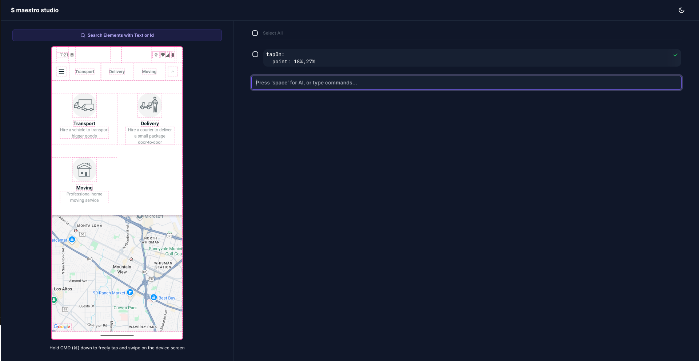

# GoGoX App 使用 Maestro 進行端對端自動化測試

繁體中文 | [English](README.md)

本專案包含使用 [Maestro](https://maestro.dev/) 對 GoGoX 行動應用程式進行端對端（E2E）自動化測試，Maestro 是一個強大的行動 UI 測試框架。這些測試設計為在 Android 和 iOS 平台上運行。

## 📱 關於 GoGoX 應用程式

GoGoX 是一個領先的按需物流平台，連接用戶與配送服務。此測試套件確保行動應用程式在不同設備和平台上的品質和可靠性。

## 🚀 功能特色

- **跨平台測試**：支援 Android 和 iOS 平台
- **雲端執行**：在 BrowserStack 上運行以實現可擴展測試
- **簡單 YAML 配置**：易於閱讀和維護的測試流程
- **Maestro Studio 視覺化測試**：互動式 UI 檢查和流程創建
- **本地和設備測試**：在本地設備或模擬器上運行測試
- **全面覆蓋**：測試關鍵用戶旅程和應用程式功能

## 🛠️ 先決條件

在運行測試之前，請確保您已安裝以下項目：

- [Maestro CLI](https://docs.maestro.dev/getting-started/installing-maestro)
- GoGoX 應用程式建置檔案（Android APK/iOS IPA）或已安裝應用程式的實體設備

### 安裝 Maestro

在 macOS、Linux 或 Windows (WSL) 上運行以下命令來安裝 Maestro：

```bash
curl -fsSL "https://get.maestro.mobile.dev" | bash
```

如果您使用 macOS，可以使用 Homebrew 代替上述安裝腳本：

```bash
brew tap mobile-dev-inc/tap
brew install maestro
```

💡 **使用 Windows？** 請參考此指南在 Windows 機器上進行設定：[在 Windows 上安裝 Maestro](https://docs.maestro.dev/getting-started/installing-maestro)

## 🔧 配置

### 應用程式配置

主要配置定義在 `maestro/launch.yaml` 中：

```yaml
appId: hk.gogovan.GoGoVanClient2
---
- launchApp
```

此配置：
- 指定 GoGoX 應用程式的 bundle identifier
- 定義基本的啟動測試流程

## 🏃‍♂️ 運行測試

### 本地測試

用於本地開發和測試：

```bash
# 運行特定流程
maestro test maestro/launch.yaml

# 運行 maestro 目錄中的所有流程
maestro test maestro/

# 以詳細輸出運行以進行除錯
maestro test --verbose maestro/launch.yaml
```

## 🔍 可用的 Maestro 指令

本專案利用 Maestro 的全面指令集。以下是您可以使用的一些關鍵指令：

### 導航和互動
- `launchApp` - 啟動應用程式
- `tapOn` - 點擊 UI 元素
- `doubleTapOn` - 雙擊元素
- `longPressOn` - 長按元素
- `swipe` - 滑動手勢
- `scroll` - 滾動操作
- `back` - 返回導航

### 輸入和文字
- `inputText` - 在欄位中輸入文字
- `eraseText` - 清除欄位中的文字
- `pasteText` - 貼上剪貼簿內容
- `copyTextFrom` - 從元素複製文字

### 斷言
- `assertVisible` - 驗證元素可見性
- `assertNotVisible` - 驗證元素不可見
- `assertTrue` - 斷言條件
- `assertWithAI` - AI 驅動的斷言

### 進階功能
- `waitForAnimationToEnd` - 等待動畫結束
- `takeScreenshot` - 截圖
- `runScript` - 執行 JavaScript
- `setLocation` - 模擬 GPS 位置
- `setOrientation` - 更改設備方向

完整的指令列表請參考 [Maestro API 參考](https://docs.maestro.dev/api-reference/commands)。

## 🎯 Maestro Studio

Maestro Studio 是一個強大的互動式工具，幫助您視覺化地創建和除錯測試流程。它提供應用程式 UI 階層的即時視圖，並允許您直接與元素互動。



### 啟動 Maestro Studio

```bash
# 啟動 Maestro Studio
maestro studio
```

這將在您的瀏覽器中打開一個 Web 界面，您可以：

### 主要功能

1. **視覺化元素檢查**
   - 查看應用程式的完整 UI 階層
   - 檢查元素屬性（id、文字、無障礙標籤）
   - 查看元素邊界和定位

2. **互動式測試**
   - 直接在瀏覽器中點擊元素
   - 在撰寫 YAML 之前測試互動
   - 自動生成測試步驟

3. **即時流程創建**
   - 在執行互動時錄製
   - 將錄製的流程匯出為 YAML 格式
   - 即時編輯和優化流程

4. **除錯支援**
   - 逐步執行現有流程
   - 識別為什麼找不到元素
   - 驗證選擇器和斷言

### 使用 Maestro Studio 工作流程

1. **連接您的設備**並啟動應用程式
2. **啟動 Maestro Studio**：`maestro studio`
3. **檢查元素**：在瀏覽器中將滑鼠懸停在元素上
4. **錄製互動**：點擊錄製按鈕
5. **匯出您的流程**到 YAML 檔案
6. **優化和測試**您生成的流程

### Studio 工作流程範例

```bash
# 1. 啟動 studio
maestro studio

# 2. 在瀏覽器界面中：
#    - 瀏覽您的應用程式
#    - 點擊元素進行檢查
#    - 錄製您的測試場景
#    - 匯出為 YAML

# 3. 保存生成的流程
# 4. 測試流程
maestro test your-generated-flow.yaml
```

### Studio 使用技巧

- **使用 Studio 進行元素發現**：當元素難以找到時，Studio 顯示所有可用的選擇器
- **錄製複雜手勢**：Studio 可以捕獲滑動、滾動和多點觸控互動
- **驗證流程**：使用 Studio 逐步執行現有流程並除錯問題
- **生成基礎流程**：快速創建初始流程，然後手動優化

## 📝 撰寫測試流程

### 基本流程結構

```yaml
appId: hk.gogovan.GoGoVanClient2
---
- launchApp
- tapOn: "登入"
- inputText: "user@example.com"
- tapOn: "密碼"
- inputText: "password123"
- tapOn: "登入"
- assertVisible: "歡迎"
```

## 🐛 故障排除

### 常見問題

1. **應用程式無法啟動**：驗證 `appId` 是否與您的應用程式 bundle identifier 匹配
2. **找不到元素**：使用 Maestro Studio 檢查 UI 元素並找到正確的選擇器
3. **逾時**：為載入緩慢的畫面增加等待時間
4. **設備連接**：確保您的設備已正確連接並被識別
5. **流程執行失敗**：使用 Maestro Studio 逐步執行流程並識別問題

### 除錯指令

```bash
# 查看設備階層
maestro hierarchy

# 啟動 Maestro Studio 進行視覺化除錯
maestro studio

# 互動式錄製流程
maestro record

# 以詳細輸出運行
maestro test --verbose maestro/launch.yaml

# 使用 Studio 整合測試特定流程
maestro studio --flow maestro/launch.yaml
```

### 使用 Maestro Studio 進行除錯

當測試失敗時，Maestro Studio 對於除錯非常寶貴：

1. **元素找不到錯誤**：
   ```bash
   maestro studio
   # 使用視覺檢查器找到正確的元素選擇器
   ```

2. **流程步驟驗證**：
   ```bash
   maestro studio --flow maestro/your-flow.yaml
   # 逐步執行每個動作以查看失敗位置
   ```

3. **UI 階層檢查**：
   - 啟動 Studio 並導航到有問題的畫面
   - 檢查元素樹以了解 UI 結構
   - 從 Studio 複製正確的選擇器到您的 YAML 檔案

## 📚 資源

- [Maestro 文件](https://docs.maestro.dev/)
- [Maestro API 參考](https://docs.maestro.dev/api-reference/commands)
- [Maestro GitHub 儲存庫](https://github.com/mobile-dev-inc/maestro)

## 📄 授權

本專案使用 MIT 授權 - 詳情請參閱 [LICENSE](LICENSE) 檔案。

## 📞 支援

如有相關問題，請聯繫：
- **Maestro 框架**：訪問 [Maestro 文件](https://docs.maestro.dev/)
- **本專案**：在此儲存庫中開啟 issue

---

**測試愉快！🚀**
